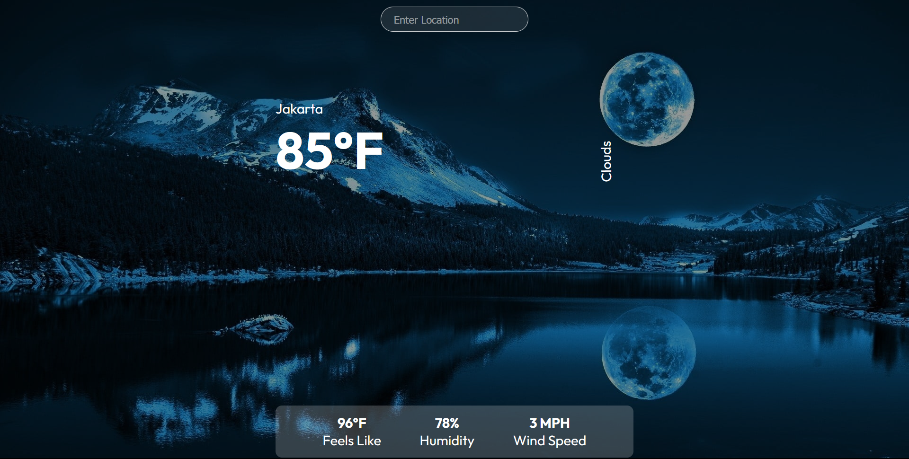

Weather App

Aplikasi Cuaca adalah aplikasi sederhana yang memungkinkan Anda memeriksa kondisi cuaca berdasarkan lokasi yang Anda masukkan. Aplikasi ini dibangun menggunakan React.


## Fitur
- Menampilkan cuaca saat ini untuk lokasi yang Anda cari.
- Menampilkan suhu dalam Fahrenheit.
- Menampilkan deskripsi cuaca.
- Menampilkan "Terasa Seperti" (feels like) suhu, kelembapan, dan kecepatan angin.

Aplikasi ini dibuat sebagai proyek demonstrasi untuk belajar React dan pengembangan web. Cobalah sekarang dan lihat seberapa cepat Anda bisa mengetik!

## Memulai
Untuk menjalankan proyek ini di komputer lokal Anda, ikuti langkah-langkah berikut:

1. Clone repositori:

   ```bash
   git clone https://github.com/nama-anda/aplikasi-cuaca.git
   cd aplikasi-cuaca
   npm install
   REACT_APP_WEATHER_API_KEY=kunci-api-anda-di-sini
   npm start

## Teknologi
- React
- Axios

## API 
- OpenWeatherMap API

# Lisensi
Aplikasi ini dilisensikan di bawah [MIT License](LICENSE).

Dibuat oleh [Giovan Orlen]
